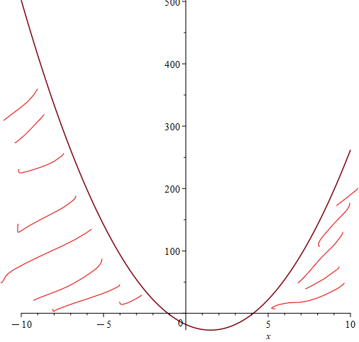

# Classroom 7
This week covers chapter 5 in Gill which is derivatives and integrals. We will be practicing L'Hospital's rule, logarithmic differentiation, definite integrals, split integrals and more. I have provided many hints which can be found at the bottom of the notebook as I am unfortunately not present in class this week.

## 5.1
*Hint 1

Solution:

We know that the given functions are continuous at $x=a$ and $y=a$. Thus, we can solve for $f(a)$ as seen below

$$
\lim _{x \rightarrow 4}\left(x^2-6 x+4\right)=\left(4^2-6(4)+4\right)=-4
$$

$$
\lim _{x \rightarrow 4}\left(\frac{x^2}{3 x-2}\right)=\left(\frac{4^2}{3(4)-2}\right)=\frac{8}{5}
$$
$$
\lim _{x \rightarrow 0}\left(\frac{x-25}{x+5}\right)=\left(\frac{0-25}{0+5}\right)=-5
$$
$$
\lim _{y \rightarrow 1}\left(\frac{y^4-1}{y-1}\right)=\lim _{y \rightarrow 1} \frac{(y-1)(y+1)\left(y^2+1\right)}{(y-1)}=4
$$

## 5.2
*Hint 2

Solution:
We can utilize the properties 
$$\lim _{x \rightarrow X}[f(x)-g(x)]=\lim _{x \rightarrow X} f(x)-\lim _{x \rightarrow X} g(x)$$
$$ \lim _{x \rightarrow X}[f(x) g(x)] \quad = \lim _{x \rightarrow X} f(x) \lim _{x \rightarrow X} g(x)$$
$$\lim _{x \rightarrow X}[k g(x)]=k \lim _{x \rightarrow X} g(x)$$
to determine determine the limit 
```{r}
-2 - 3*(-2)*2
```
## 5.3
Hint 3

We can use L'Hospital's rule which is given as 

$$
\lim _{x \rightarrow \infty}\left(\frac{f(x)}{g(x)}\right) \text { to } \lim _{x \rightarrow \infty}\left(\frac{f(x)^{\prime}}{g(x)^{\prime}}\right)
$$
to solve the infinite limits

$$
\lim _{x \rightarrow \infty}\left(\frac{9 x^2}{x^2+3}\right)=\lim _{x \rightarrow \infty}\left(\frac{18 x}{2 x}\right)=\lim _{x \rightarrow \infty}(9)=9
$$
$$
\lim _{x \rightarrow \infty}\left(\frac{3 x-4}{x+3}\right)=\lim _{x \rightarrow \infty}\left(\frac{3}{1}\right)=3
$$

## 5.5
*Hint 5

Solution:
To compute the derivatives use the power rule $$\frac{d}{d x} x^n=n x^{n-1}$$

$$
\frac{d\left(3 x^{\frac{1}{3}}\right)}{d x}=x^{-\frac{2}{3}}=\frac{1}{(\sqrt[3]{x})^2}
$$

$$
\frac{d\left(y^3+3 y^2-12\right)}{d y}=3 y^2+6 y
$$
$$
\frac{d\left(x^2+1\right)\left(x^3-1\right)}{d x}=\frac{d\left(x^5-x^2+x^3-1\right)}{d x}=5 x^4-2 x+3 x^2
$$
$$
\frac{d\left(y-y^{-1}\right)\left(y-y^{-2}\right)}{d y}=\frac{d\left(y^2+y^{-1}-1+y^{-3}\right)}{d y}=2 y+y^{-2}-3 y^{-4}
$$

$$
\frac{d \exp \left(y^2-3 y+2\right)}{d y}=\left(e^{y^2-3 y+2}\right)(2 y-3)
$$

$$
\frac{d(14 t-7)}{d t}=14
$$
$$
\frac{d\left(\frac{1}{100} x^{25}-\frac{1}{10} x^{0.25}\right)}{d x}=\frac{1}{4} x^{24}-\frac{1}{40} x^{-\frac{3}{4}}
$$

$$
\frac{d\left(y^3-7\right)\left(1+\frac{1}{y^2}\right)}{d y}=\frac{d\left(y^3+y-7-\frac{7}{y^2}\right)}{d y}=3 y^2+\frac{14}{y^3}+1
$$
the next derivative is calculated using the quotient rule 
$$
\frac{d}{d x}\left[\frac{f(x)}{g(x)}\right]=\frac{g(x) \frac{d}{d x} f(x)-f(x) \frac{d}{d x} g(x)}{g(x)^2} .
$$
$$
\frac{d\left(\frac{4 x-12 x^2}{x^3-4 x^2}\right)}{d x} =\frac{\left[\left(x^3-4 x^2\right)(4-24 x)\right]-\left[\left(4 x-12 x^2\right)\left(3 x^2-8 x\right)\right]}{\left(x^3-4 x^2\right)^2} =\frac{12 x^4-8 x^3+16 x^2}{x^6-8 x^5+16 x^4}
$$
the last derivative is solved using the chain rule 
$$
\frac{d}{d x} f(g(x))=f^{\prime}(g(x)) g^{\prime}(x)
$$
such that we get
$$
\frac{d \log \left(2 \pi x^2\right)}{d x}=\frac{1}{2 \pi x^2}(4 \pi x)=\frac{2}{x}
$$
## 5.7
*Hint 7

Solution: see handwritten solution

## 5.8

Solution:
L'Hospital's rule is used to evaluate the limits
$$
\lim _{x \rightarrow 1}\left(\frac{\sin (1-x)}{x^2-1}\right)=\lim _{x \rightarrow 1}\left(\frac{-\cos (-1+x)}{2 \cdot x}\right)=-\frac{1}{2}
$$

$$
\lim _{x \rightarrow 0}\left(\frac{x}{\sin (\pi x)}\right)=\lim _{x \rightarrow 0}\left(\frac{1}{\pi \cos (\pi x)}\right)=\frac{1}{\pi}
$$

$$
\lim _{x \rightarrow \infty}\left(\frac{\log (x)}{x}\right)=\lim _{x \rightarrow \infty}\left(\frac{1}{x^2}\right)=0
$$

$$
\lim _{x \rightarrow \infty} \left(\frac{3^x}{x^3}\right) = \infty
$$
$$
\lim _{y \rightarrow 0}\left(\frac{e^y \sin (y)}{\log (1-y)}\right)=\lim _{y \rightarrow 0}\left(\frac{e^y \sin (y)+e^y \cos (y)}{-\frac{1}{1-y}}\right)=\frac{1}{-\frac{1}{1}}=-1
$$

$$
\lim _{y \rightarrow 0} \frac{(\sin (y))^2-\sin \left(y^2\right)}{y}=\lim _{y \rightarrow 0}\frac{2 \sin (y) \cos (y)-2 y \cos \left(y^2\right)}{1}=0
$$

$$
\lim _{y \rightarrow \infty}\left(\frac{3 e^y}{y^3}\right)=\lim _{y \rightarrow \infty}\left(\frac{3 e^y}{3 y^2}\right)=\infty
$$

$$
\lim _{x \rightarrow \infty}\left(\frac{x \cdot \log (x)}{x+\log (x)}\right)=\lim _{x \rightarrow \infty}\left(\frac{\log (x)+1}{1+\frac{1}{x}}\right)=\infty
$$
## 5.10
*Hint 10

Solution:
Using the fundamental theorem of Calculus presented below, we can determine the definite integrals.
$$
\int_a^b f(x) d x=F(b)-F(a)
$$

We can determine $F(x) = \frac{1}{4} \cdot x^4$

$$
\int_6^8 x^3 \mathrm{~d} x=\frac{1}{4} \cdot 8^4-\frac{1}{4} \cdot 6^4=700
$$
In the next we have $F(x) = \frac{1}{3} \cdot x^6$
$$
\int_1^9 2 \cdot y^5 \mathrm{~d} y=\frac{1}{3} \cdot 9^6-\frac{1}{3} \cdot 1^6
$$
```{r}
(1/3)*9^6-(1/3)*1^6
```

Then we have that $F(x) = x^3-x$
$$
\int_{-1}^0\left(3 x^2-1\right) \mathrm{d} x=\left(0^3-0\right)-\left(-1^2-(-1)\right) = 0
$$

In the next $F(x) = 14 x+\frac{1}{3} \cdot x^3$
$$
\int_{-1}^1 14+x^2 d x=\left(14 \cdot 1+\frac{1}{3} \cdot 1^3\right)-\left(14 \cdot(-1)+\frac{1}{3} \cdot(-1)^3\right)
$$
```{r}
14+(1/3)+14+(1/3)
```
The next antiderivative is $F(t) = -\frac{1}{t}$
$$
\int_1^2 \frac{1}{t^2} \mathrm{~d} t=-\frac{1}{2}-\left(-\frac{1}{1}\right)=\frac{1}{2}
$$
$$
\int_2^4 e^y d y=e^4-e^2
$$
```{r}
exp(4)-exp(2)

```
The next antiderivative is $F(x) = \frac{1}{3} \cdot\left(1+x^2\right)^{\frac{3}{2}}$


$$
\int_{-1}^2 x \sqrt{1+x^2} \mathrm{~d} x =
\left(\frac{1}{3} \cdot\left(1+2^2\right)^{\frac{3}{2}}\right)-\left(\frac{1}{3} \cdot\left(1+(-1)^2\right)^{\frac{3}{2}}\right)
$$
```{r}
((1/3)*(1+2^2)^(3/2))-((1/3)*(1+(-1)^2)^(3/2))
```
The next antiderivative is $F(x) = \frac{1}{3} \cdot x^3-2 \cdot \log (x)$
Here we see that definite integral is undefined because the logarithm of a negative number is undefined.
$$\int_{-100}^{100}\left(x^2-\frac{2}{x}\right) \mathrm{d} x = undefined$$
The final antiderivative is $F(x) = \frac{2}{3} \cdot x^{\frac{3}{2}}$

$$
\int_2^4 \sqrt{t} \mathrm{~d} t=\frac{2}{3} \cdot 4^{\frac{3}{2}}-\frac{2}{3} \cdot 2^{\frac{3}{2}}
$$
```{r}
(2/3)*4^(3/2) - (2/3)*2^(3/2)
```
## 5.11
This is a slightly harder exercise. Thus, I will provide more hints ;)

*Hint 11.1, 11.2, 11.3

Solution:
In order to find the area that lies above the function within the domain [-10,10] we need to first determine whether the parabola is happy or sad. We see that 4x^2 is positive and thus the parabola is happy.

The next step is then to determine the roots of the second order polynomium, which can be done using the standard fomula or using uniroot in R as seen below
$$
x=\frac{-b \pm \sqrt{b^2-4 a c}}{2 a}
$$
```{r}
# Function with equation
fun <- function(x) {4 * x ^ 2 + 12 * x - 18}
  
# Calling uniroot() function
uniroot(fun, lower = 0, upper = 10)$root
uniroot(fun, lower = -10, upper = 0)$root
```
Okay, so in order to obtain the area that is above the x-axis and within the x-interval [-10,10] we need to determine two definite integrals. I have tried to illustrate the areas that the two integrals correspond to in the image below.  




$$
\int_{-10}^{-4.1}\left(4 x^2+12 x-18\right) d x = \left(\frac{4}{3}(-4.1)^3+6(-4.1)^2-18(-4.1)\right)-\left(\frac{4}{3}(-10)^3+6(-10)^2-18(-10)\right) = (-118.9547)-(-1753.3330)=1634.378
$$
and

$$
\int_{1.1}^{10}\left(4 x^2+12 x-18\right) d x = \left(\frac{4}{3}(10)^3+6(10)^2-18(10)\right)-\left(\frac{4}{3}(1.1)^3+6(1.1)^2-18(1.1)\right) =(1753.330)-(-10.76533)=1764.098
$$
This gives the total area under the curve between -10 and 10
$$
1634.378+1764.098=3398.476
$$

Hint 1: Have a look at example 5.1 and 5.2 in Gill
Hint 2: Look at the properties of limits (specifically the properties of addition and subtraction, multiplication and scalar multiplication)
Hint 3: Notice that these are infinite limits (thus we can use L'Hospital's rule).
Hint 5: Use the power rule for derivatives $\frac{d}{d x} x^n=n x^{n-1}$
Hint 7: See page 197 in Gill use logarithmic differentiation
Hint 10: Use the fundamental theorem of calculus as seen on page 211 in Gill
Hint 11.1: First consider how the parabola of f(x) looks. Is it happy or sad?
Hint 11.2: What are the roots of the polynomial?
Hint 11.3: Compute definite split integrals
